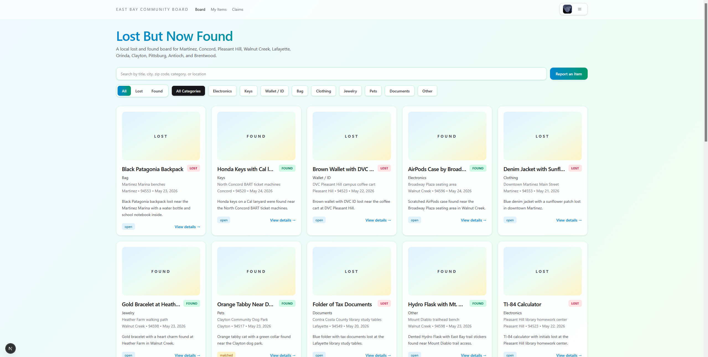
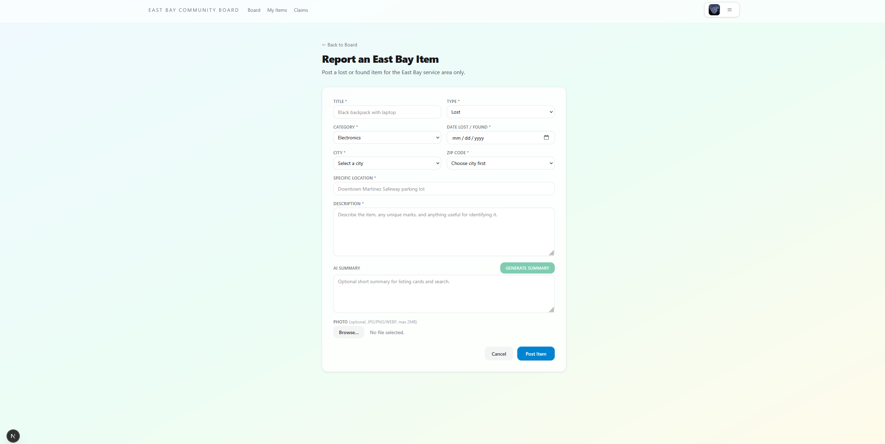
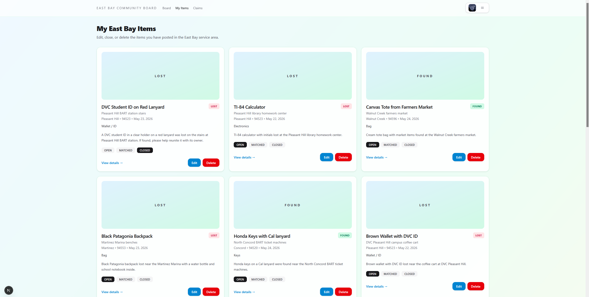
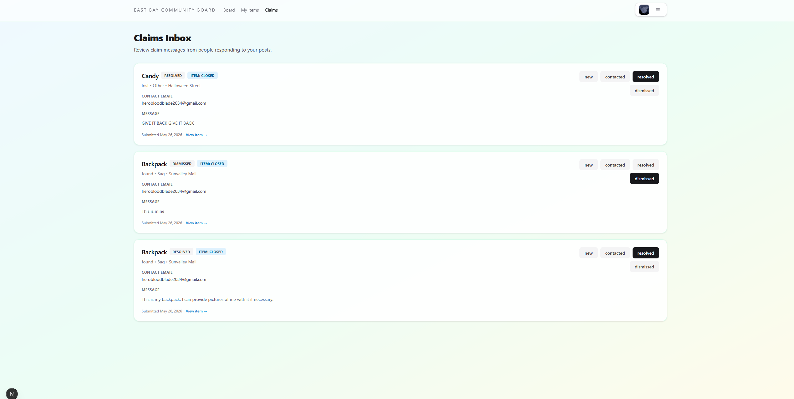

# Lost But Now Found

Lost But Now Found is a full-stack lost and found web application built for the East Bay Area. It allows users to sign in with Google, post lost or found items, upload item photos, search listings, submit claims, and manage their own posts.

This app is limited to selected East Bay cities and ZIP codes so the board stays local and relevant.

## Features

- Google sign-in with Supabase Auth
- Report lost and found items
- Upload item images with Supabase Storage
- Search by title, city, ZIP code, category, or location
- Filter by item type and category
- Submit claims for posted items
- Manage your own posts from the My Items page
- Review incoming claims from the Claims page
- AI-generated summaries for item listings
- Light / Dark / System theme support
- East Bay city and ZIP code restrictions

## East Bay Service Area

This app currently supports these East Bay cities:

- Martinez
- Concord
- Pleasant Hill
- Walnut Creek
- Lafayette
- Orinda
- Clayton
- Pittsburg
- Antioch
- Brentwood

## Tech Stack

- **Frontend:** Next.js 16, React 19, TypeScript
- **Styling:** Tailwind CSS
- **Authentication:** Supabase Auth with Google OAuth
- **Database:** Supabase Postgres
- **Storage:** Supabase Storage
- **Notifications:** Sonner
- **Email:** Resend
- **AI:** DeepSeek API
- **Deployment:** Vercel

## Setup Instructions

### 1. Clone the repository

```bash
git clone https://github.com/shxhxi/lost-found-board.git
cd lost-found-board
```

### 2. Install dependencies

```bash
npm install
```

### 3. Create a `.env.local` file

Add the following environment variables:

```env
NEXT_PUBLIC_SUPABASE_URL=your_supabase_url
NEXT_PUBLIC_SUPABASE_PUBLISHABLE_KEY=your_supabase_publishable_key
NEXT_PUBLIC_SITE_URL=http://localhost:3000
NEXT_PUBLIC_ADMIN_EMAIL=your_admin_email

RESEND_API_KEY=your_resend_api_key
DEEPSEEK_API_KEY=your_deepseek_api_key
```

### 4. Set up Supabase

You need to:

- create a Supabase project
- enable Google OAuth
- configure your redirect URLs
- create the required database tables
- create the storage bucket for item photos
- apply the Row Level Security policies

### 5. Run the development server

```bash
npm run dev
```

Then open:

```text
http://localhost:3000
```

## Screenshots

### Homepage / Board


### Report Item Page


### My Items Page


### Claims Page


## How It Works
- A user signs in with Google
- The user creates a lost or found post
- The item is saved in Supabase
- The user can optionally upload an image
- The app can generate an AI summary for the item
- Other signed-in users can submit claims
- The item owner can review claims and manage the post